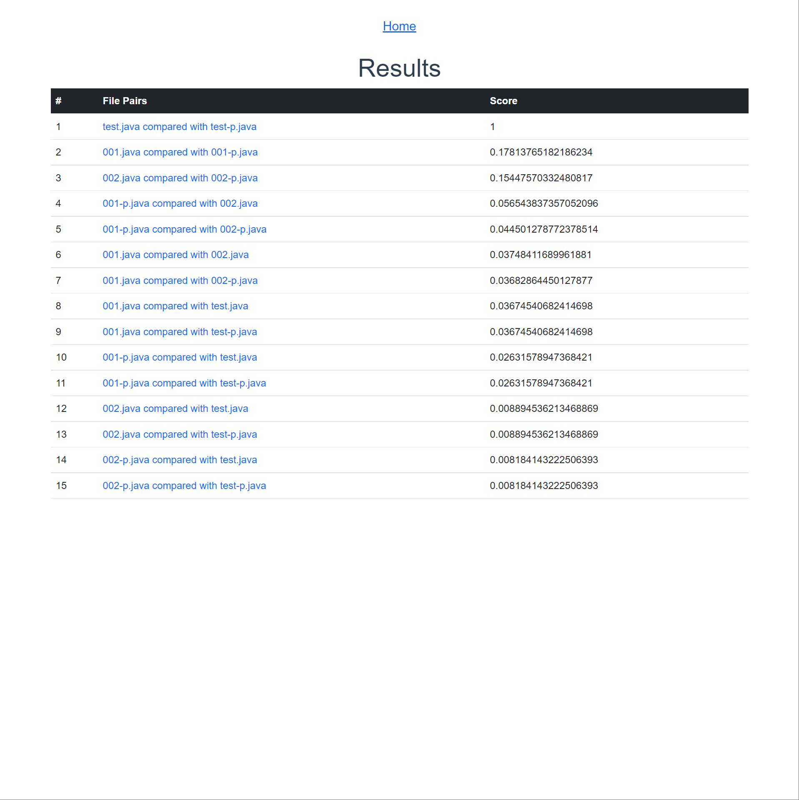
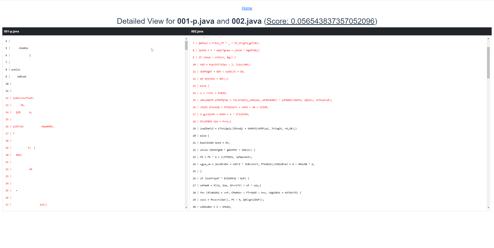
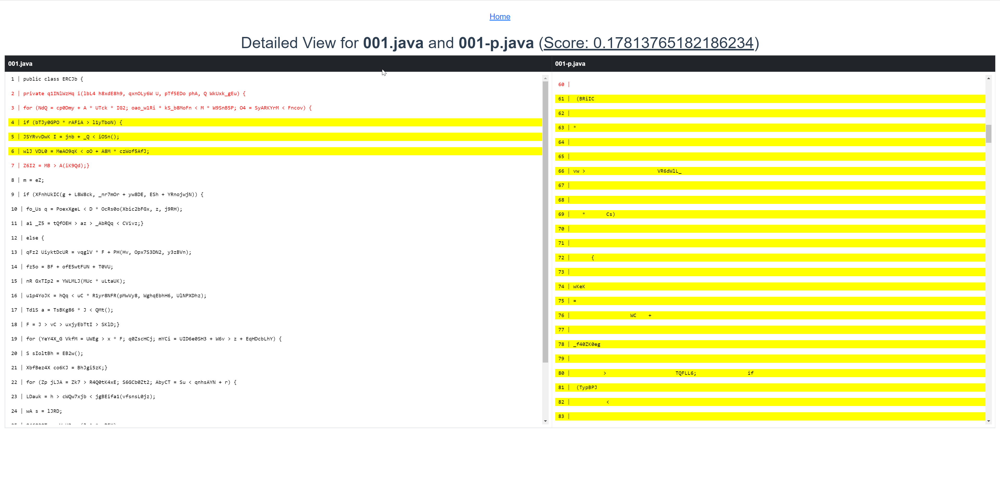

# visualization-app

## About

A Vue.js client for [FETT](https://github.com/lawtonnichols/plagiarism-detector), A Software Plagiarism Detection Tool.

FETT takes source code files, compares the files for plagiarism, and outputs scores that reflect the weight of suspicion of plagiarism. These scores alone are not informative enough for the user to know which sections of the source code files caused suspicion of plagiarism. Therefore, [this paper](http://hdl.handle.net/10211.3/218231) elaborates the approach of modifying FETT's use of the [Smith-Waterman Algorithm](https://en.wikipedia.org/wiki/Smith%E2%80%93Waterman_algorithm) and presenting the results using Vue.js.

## Goal

Users should be able to:

- see within 7 seconds the top file pairs that caused the most suspicion of plagiarism
- see the file pair matches on a side-by-side view of both source code files

### Built With

- Vue.js

## Project Setup

To run locally, follow the steps below

### Prerequisites

- Node.js 8.11+ installed
- npm

### Installation

- Clone repo

```
git clone git@github.com:EdwardOlmos/visualization-app.git
```

- Install dependencies

```
npm install
```

- Run the application (Compiles and hot-reloads for development)

```
npm run serve
```

## How to Use

After running `npm run serve`, a browser window will automatically pop up with the app running on a local port.

### First View

This view is the landing page of the application. Users can see a table containing test data from a previous run done on FETT.

The first column contains all the file pairs, and the right column shows an arbitrary numeric score. Users can click on a file pair to see more details about how it got its score.



_Note_: The test data is already filtered, from highest to lowest scores.

### Second View

This view provides detailed information with a side-by-side view of the compared source code files. Users can observe which lines of code FETT considered suspicious of plagiarism by noticing the color scheme.
Black-colored code infers no suspicion of plagiarism.
A red-colored code signifies possible plagiarism.
Selected file matches will be highlighted in yellow.

Users can click on the red-colored code from either the left or right-hand file to see matches associated with it. Once clicked, the selected line will highlight yellow and the other matching lines of code.





### Sample Data File

There is sample data located at `/src/script_results.js` that temporarily enacts as a GET call for test data provided by FETT. The sample data is imported and used for the following information about the compared source code files fed into FETT:

- File Names
- Set of Matches for each file comparison
- Scores for each file comparison

## Roadmap

See the open issues for a list of proposed features (and known issues)

### Customize configuration

See [Configuration Reference](https://cli.vuejs.org/config/).

## Acknowledgments

- [csun-tavlab](https://github.com/csun-tavlab)

## References

- [Plagiarism Detection Tool](https://dl.acm.org/doi/10.1145/3304221.3319789)
- [Visualizing Plagiarism Detection Results](http://hdl.handle.net/10211.3/218231)

## Glossary

- **File Pairs**: Two source code files compared by FETT
- **Suspicion** of Plagiarism: Suspicion of plagiarism based on FETT
- **File Pair Matches**: An array of source code files' line numbers that matched based on FETT
